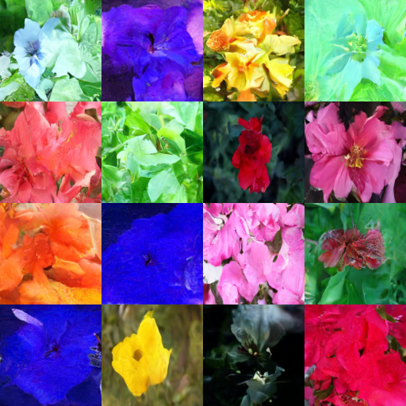

# Flower Image Generation with Denoising Diffusion Probabilistic Models (DDPM)

## Repository Contents

- `inference.ipynb`: Jupyter notebook for running inference with the trained DDPM model.
- `ddpm-training.ipynb`: Jupyter notebook for training the DDPM model on the Flowers-102 dataset.
- `requirements.txt`: Python dependencies required for the project.

To set up your environment and replicate the results, follow the instructions below:


### Instructions for Setting Up the Environment

1. **Install Python Packages**: 
   - Run the following command to install the required Python packages:
     ```bash
     pip install -r requirements.txt -f https://storage.googleapis.com/jax-releases/jax_cuda_releases.html
     ```

2. **Install Git LFS**:
   - **Unix-based Systems**:
     ```bash
     sudo apt-get -qq update
     sudo apt-get -qq install git-lfs
     ```
   - **Windows Systems**:
     Visit the [Git LFS installation page](https://git-lfs.github.com/) and follow the instructions for installing Git LFS on Windows.

3. **Configure Git Credentials**:
   - Run the following command to configure Git to store your credentials:
     ```bash
     git config --global credential.helper store
     ```

### Key Additions

1. **Using the Trained Model**: Download the trained model from releases section. Extract it into a folder.
2. **Updating the Path in Notebooks**: Update the `model_path` variable in the notebooks to point to the directory where the model is placed.

## Usage

After setting up the environment, you can use the provided Jupyter notebooks to train the model and run inference.

### Training the Model

1. Open `ddpm-training.ipynb` in Jupyter Notebook.
2. Follow the step-by-step instructions to train the DDPM model using the Flowers-102 dataset.

### Running Inference

1. Open `inference.ipynb` in Jupyter Notebook.
2. Follow the instructions to generate flower images using the trained DDPM model.

## Example Prediction

Here is an example of a flower image generated by the trained DDPM model:



### Acknowledgments
1. The DDPM implementation is based on the diffusers library by Hugging Face.
2. The Flowers-102 dataset is part of the Hugging Face Dataset.
3. The code in this repository was adopted from Hugging Face tutorials. Special thanks to Hugging Face for their excellent resources and tools.

### License
This project is licensed under the MIT License. See the LICENSE file for details.

